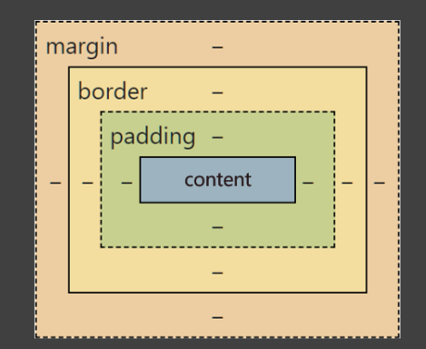

# 知识点自测

都是前端三件套比较基本和常用的一些知识点，建议食用方法：**先自己填一遍，每个问题再单独查一遍**。

*此部分不建议一上来就使用 AI，最终要求完成即可，重在自我检验。*
*本文为了可读性在代码处采用了 markdown 语法，能理解题意就行。*

## HTML

- Q1：你能说出哪些标签？与表单相关的是哪几个？
  A1：`<html><head><body><title>

<h1><a><ol><ul><li><dl><dd><dt><table><caption><thead><tbody><tfoot><tr><th><td> 
<form><input><button><select><option><label><style><meta>`
- 表单相关：`<form><input><button><select><option><label>`
- Q2：补全 `style` 属性，使 `

`的宽为 `100px`、高为 `100px`。
  A2: `

`

## CSS

- Q1：选择器有哪几种分类？
  A1：基本选择器（通配，元素，类，id），交集选择器，并集选择器，后代选择器，子代选择器（>），兄弟选择器（~），属性选择器([]),伪类选择器(:),9伪元素选择器(::)
- Q2：分别说几种伪类和伪元素？
  A2:伪类 :hover :focus :first-child :last-child :nth-child(n)
  伪元素：::first-letter ::first-line  ::before  ::after  ::selection
- Q3：flex 布局和 grid 布局分别有哪些常用属性？
  A3：flex布局：flex-direction（主轴方向）justify-content（主轴上的对齐方式）align-items（交叉轴上的对齐方式）flex-wrap（是否换行）
- grid 布局：grid-template-columns（列的宽度和数量）grid-template-rows（行的宽度和数量）gap（网格间距）grid-area（划分区域）grid-column（跨越多少行）grid-row（跨越多少列）
- Q4：说说盒模型的构成？
  A4：

## JavaScript

- Q1：JS 中有哪些**基本数据类型**？
  A1：number类型，BigInt 类型，string类型，boolean 类型，null值，undefined值，object类型
- Q2：如何通过 dom 操作获取 `id` 为 `test` 的元素，为其添加一个 "click" 事件？
  A2：
- let a = document.getElementById(test);
- a.onclick = function(){
- alert('点击');
- }
- Q3：箭头函数对比普通函数的区别有哪些？
  A3：
- 箭头函数语法更简洁
- 箭头函数没有自己的this，继承外层
- 箭头函数不能作为构造函数，箭头函数不能使用new关键字
- 箭头函数没有arguments对象
- 箭头函数没有prototype 属性
- Q4：已知一个变量 `num === 1`，写一个模版字符串，使其显示结果为 `“class1”`，即在 `"class"` 后面插入变量 `num`。
  A4：`
{}
`
